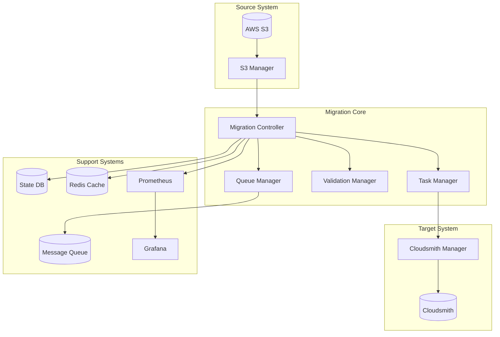

# HLD-cloudsmith

## 1. Problem Analysis & Requirements

### Business Requirements
- Migrate artifacts from AWS S3 to Cloudsmith
- Support three distinct use cases:
  1. Small team: ~10MB data
  2. Medium team: ~10GB data
  3. Large team: ~1TB data
- Zero data loss guarantee
- Minimal downtime
- Progress tracking and reporting

### Technical Requirements
- Secure data transfer
- Data integrity verification
- Performance optimization
- Error handling and recovery
- Monitoring and alerting
- Audit logging

### Constraints
- Network bandwidth limitations
- API rate limits (both S3 and Cloudsmith)
- Memory and CPU usage
- Concurrent operation limits

## 2. System Architecture

### High-Level Architecture



### Component Details

1. **Migration Controller**
   - Orchestrates entire migration process
   - Implements strategy pattern for different team sizes
   - Manages state transitions
   - Handles rollback scenarios

2. **Queue Manager**
   - Manages distributed message queue
   - Implements producer-consumer pattern
   - Handles message persistence
   - Provides message prioritization

3. **Validation Manager**
   - Checksums verification
   - Metadata validation
   - Format checking
   - Size verification

4. **Task Manager**
   - Implements worker pool pattern
   - Handles task distribution
   - Manages concurrency
   - Implements rate limiting

## 3. Implementation Strategy

### Team-Specific Approaches

1. **Small Team (10MB)**
```python
class SmallTeamStrategy(MigrationStrategy):
    def execute(self):
        packages = self.source.list_packages()
        for package in packages:
            with Transaction() as tx:
                try:
                    content = self.source.download(package)
                    self.validator.validate(content)
                    self.target.upload(content)
                    tx.commit()
                except Exception as e:
                    tx.rollback()
                    self.error_handler.handle(e, package)
```

2. **Medium Team (10GB)**
```python
class MediumTeamStrategy(MigrationStrategy):
    def execute(self):
        with ThreadPoolExecutor(max_workers=10) as executor:
            packages = self.source.list_packages()
            chunks = self.chunker.split(packages)
            futures = [executor.submit(self.process_chunk, chunk) 
                      for chunk in chunks]
            self.monitor.track_futures(futures)
```

3. **Large Team (1TB)**
```python
class LargeTeamStrategy(MigrationStrategy):
    def execute(self):
        with DistributedWorkerPool() as pool:
            packages = self.source.list_packages()
            batches = self.batcher.create_batches(packages)
            for batch in batches:
                pool.submit_batch(batch)
                self.checkpoint_manager.save_state()
```

### Security Implementation

1. **Authentication**
```python
class SecurityManager:
    def setup_secure_connection(self):
        self.ssl_context = ssl.create_default_context()
        self.ssl_context.minimum_version = ssl.TLSVersion.TLSv1_3
        
    def generate_signed_url(self, package):
        return self.s3_client.generate_presigned_url(
            'get_object',
            Params={'Bucket': self.bucket, 'Key': package.key},
            ExpiresIn=3600
        )
```

2. **Encryption**
```python
class EncryptionManager:
    def encrypt_in_transit(self, data):
        return self.ssl_context.wrap_socket(data)
        
    def verify_encryption(self, connection):
        cipher = connection.cipher()
        if cipher[1] != 'TLSv1.3':
            raise SecurityException("Invalid TLS version")
```

### Error Handling & Recovery

1. **Retry Mechanism**
```python
class RetryManager:
    def __init__(self, max_retries=3, backoff_factor=2):
        self.max_retries = max_retries
        self.backoff_factor = backoff_factor
        
    @retry(stop_max_attempt_number=3, wait_exponential_multiplier=1000)
    def execute_with_retry(self, func, *args):
        try:
            return func(*args)
        except RetryableException as e:
            self.logger.warning(f"Retrying due to: {e}")
            raise
        except NonRetryableException as e:
            self.error_queue.put(e)
            raise
```

2. **State Management**
```python
class StateManager:
    def save_checkpoint(self, state):
        with self.lock:
            self.db.execute("""
                INSERT INTO checkpoints (state_id, data, timestamp)
                VALUES (?, ?, ?)
            """, (state.id, json.dumps(state.data), datetime.now()))
            
    def restore_from_checkpoint(self, checkpoint_id):
        state = self.db.query_one("""
            SELECT data FROM checkpoints 
            WHERE state_id = ?
        """, checkpoint_id)
        return json.loads(state.data)
```

## 4. Monitoring & Observability

### Metrics Collection
```python
class MetricsCollector:
    def collect_metrics(self):
        return {
            'migration_progress': self.calculate_progress(),
            'error_rate': self.calculate_error_rate(),
            'throughput': self.calculate_throughput(),
            'latency': self.measure_latency(),
            'resource_usage': self.get_resource_metrics()
        }
```

### Alerting System
```python
class AlertManager:
    def configure_alerts(self):
        self.alerts = {
            'high_error_rate': Alert(
                metric='error_rate',
                threshold=0.05,
                duration='5m',
                severity='critical'
            ),
            'low_throughput': Alert(
                metric='throughput',
                threshold=self.min_throughput,
                duration='10m',
                severity='warning'
            )
        }
```

## 5. Performance Optimization

### Caching Strategy
```python
class CacheManager:
    def __init__(self):
        self.redis_client = Redis(connection_pool=pool)
        
    def cache_package_metadata(self, package):
        key = f"package:{package.id}:metadata"
        self.redis_client.setex(
            key,
            timedelta(hours=1),
            json.dumps(package.metadata)
        )
```

### Connection Pooling
```python
class ConnectionPool:
    def __init__(self, max_connections=100):
        self.pool = queue.Queue(maxsize=max_connections)
        self.active_connections = set()
        
    def get_connection(self):
        try:
            conn = self.pool.get_nowait()
        except queue.Empty:
            conn = self.create_connection()
        self.active_connections.add(conn)
        return conn
```

## 6. Testing Strategy

### Unit Tests
```python
class MigrationTests(unittest.TestCase):
    def test_checksum_validation(self):
        content = b"test content"
        checksum = hashlib.sha256(content).hexdigest()
        self.assertTrue(
            self.validator.validate_checksum(content, checksum)
        )
```

### Integration Tests
```python
class EndToEndTests(unittest.TestCase):
    def test_small_team_migration(self):
        strategy = SmallTeamStrategy()
        result = strategy.execute()
        self.assertEqual(result.success_rate, 1.0)
        self.assertTrue(self.verify_migration_integrity())
```

### Load Tests
```python
class LoadTests(unittest.TestCase):
    def test_concurrent_migrations(self):
        with self.generate_load(users=100, duration='1h'):
            metrics = self.collect_performance_metrics()
            self.assertLess(metrics.error_rate, 0.01)
            self.assertGreater(metrics.throughput, self.min_throughput)
```

## 7. Documentation

### API Documentation
```python
class MigrationAPI:
    """
    Migration API provides interfaces for controlling the migration process.
    
    Methods:
        start_migration(config: Dict) -> MigrationJob
        pause_migration(job_id: str) -> bool
        resume_migration(job_id: str) -> bool
        get_status(job_id: str) -> MigrationStatus
    """
```

### Runbook
```markdown
## Migration Runbook

1. Pre-migration Checklist
   - Verify source system access
   - Validate target system capacity
   - Check network connectivity
   - Verify authentication tokens

2. Migration Execution
   - Start monitoring systems
   - Initialize migration job
   - Monitor progress
   - Handle any alerts

3. Post-migration Verification
   - Verify package counts
   - Check data integrity
   - Validate metadata
   - Confirm accessibility
```

## 8. Deployment Strategy

### Infrastructure as Code
```yaml
version: '3'
services:
  migration-controller:
    image: migration-tool:latest
    environment:
      - AWS_ACCESS_KEY_ID=${AWS_ACCESS_KEY_ID}
      - AWS_SECRET_ACCESS_KEY=${AWS_SECRET_ACCESS_KEY}
      - CLOUDSMITH_API_KEY=${CLOUDSMITH_API_KEY}
    depends_on:
      - redis
      - postgres
      - prometheus
      
  prometheus:
    image: prom/prometheus:latest
    volumes:
      - ./prometheus.yml:/etc/prometheus/prometheus.yml
      
  grafana:
    image: grafana/grafana:latest
    depends_on:
      - prometheus
```
